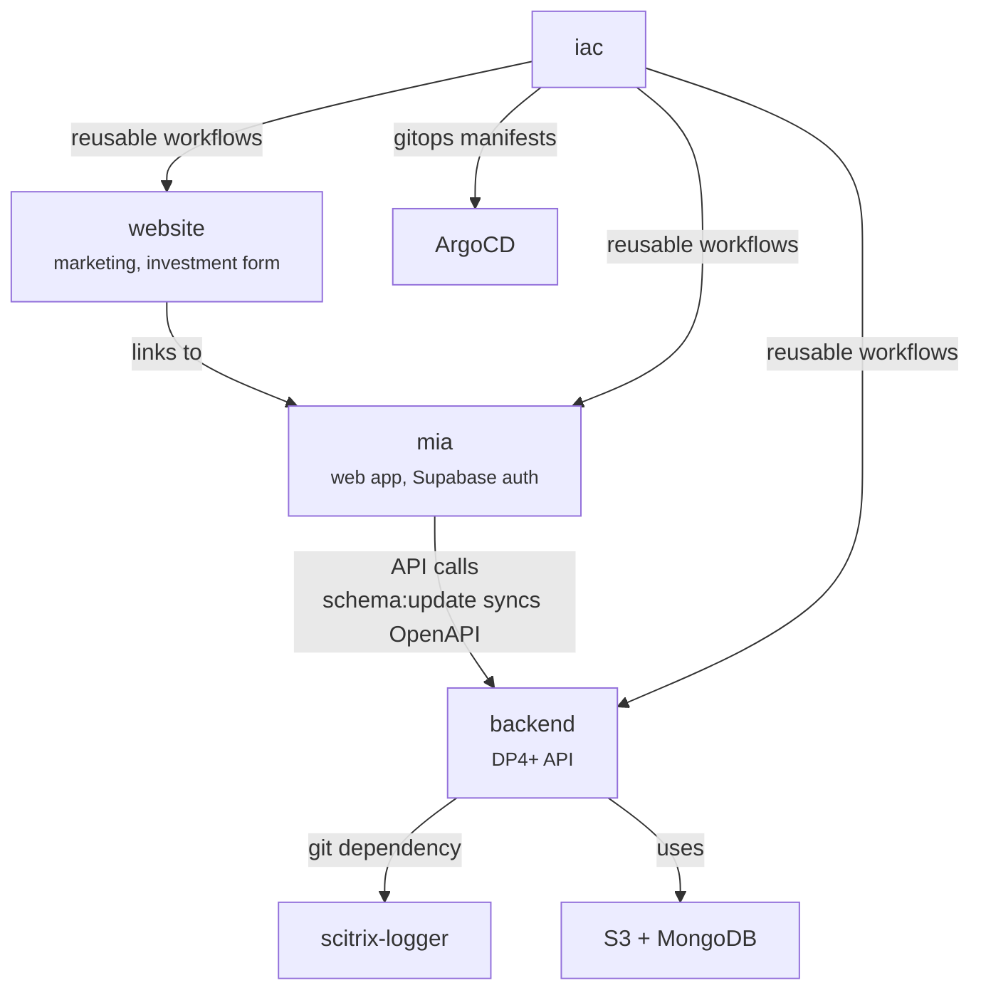
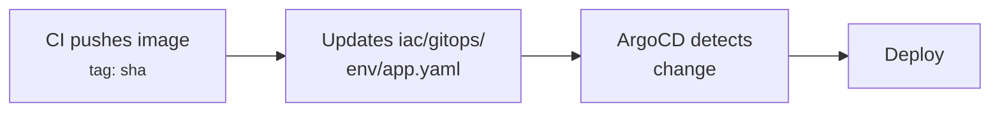
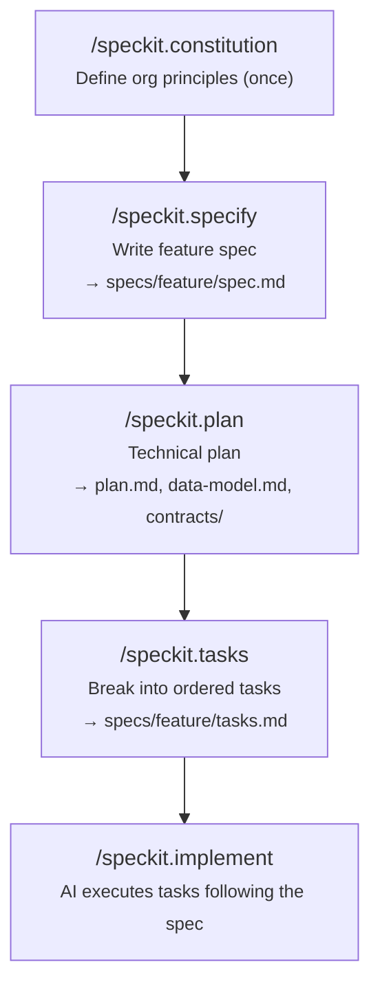

# Scitrix Organization Guide

This is the **org-level** CLAUDE.md for the Scitrix workspace. It defines cross-repo conventions, architecture, CI/CD pipelines, and the specification-driven development process.

**How this file works with repo-level files:**

- When working inside a repo (e.g., `backend/`), Claude reads BOTH this file AND the repo's `CLAUDE.md`
- This file covers **cross-repo** concerns: architecture, GitFlow, CI/CD, spec-kit
- Repo-level CLAUDE.md files cover **repo-specific** concerns: tech stack details, local dev setup, internal architecture
- If a convention is defined here AND in a repo CLAUDE.md, the **repo-level file takes precedence** for that repo

**All documentation, comments, and commit messages MUST be in English.**

---

## Organization Map

### Repositories

| Repo | Stack | Purpose | Dev Command | Package Manager |
|------|-------|---------|-------------|-----------------|
| `backend` | Python 3.12, FastAPI, MongoDB, S3 | Computational chemistry API (DP4+ algorithm) | `poetry run start` | Poetry |
| `mia` | Next.js 15, TypeScript 5, Supabase | Molecular Intelligence Assistant (web app) | `pnpm dev` | PNPM 9 |
| `website` | React 19, Vite 6, TypeScript, Three.js | Marketing website with 3D hero | `npm run dev` | NPM |
| `scitrix-logger` | Python 3.12, Poetry | Structured logging library for Python services | `poetry run pytest` | Poetry |
| `iac` | GitHub Actions YAML | Reusable CI/CD workflow templates + GitOps manifests for ArgoCD | N/A | N/A |

### Repo Relationships



### Environments

| Branch | Environment | Purpose |
|--------|-------------|---------|
| `develop` | Testing | Integration testing, QA |
| `main` | Production | Live users |

---

## Cross-Repo Architecture

### Request Lifecycle


1. **Website**: Static marketing site. Links users to MIA for the actual application.
2. **MIA**: Handles authentication (Supabase), project management UI, and proxies API calls to backend.
3. **Backend**: Processes computational chemistry requests (DP4+ algorithm), stores results in MongoDB and S3.

### API Contract Sync (MIA <-> Backend)

When backend API endpoints change:

1. Deploy the updated backend (or run locally)
2. In `mia/`, run `pnpm schema:update` to regenerate TypeScript types from the backend's OpenAPI spec
3. Source URL: `https://api.scitrix.tech` (production) - configured in `mia/package.json`
4. Fix any type errors in MIA caused by the schema changes

### scitrix-logger (Shared Library)

**Installation** (in backend `pyproject.toml`):

```toml
scitrix-logger = { git = "https://github.com/scitrix-tech/scitrix-logger.git" }
```

**Updating after changes:**

```bash
cd backend
poetry update scitrix-logger
```

**Breaking changes protocol:**

1. Make the change in scitrix-logger with a spec (see Specification-Driven Development)
2. Tag a release
3. Update backend's dependency: `poetry update scitrix-logger`
4. Fix any breakage in backend
5. PR both repos together (logger first, then backend)

### Database Ownership

| Database | Owner | ORM/ODM | Used By |
|----------|-------|---------|---------|
| MongoDB | backend | Beanie | backend (DP4+ data, pipeline results) |
| Supabase (PostgreSQL) | mia | Supabase client + SQL migrations | mia (auth, projects, user data) |
| S3 / MinIO | backend | boto3 | backend (file storage, computation artifacts) |

---

## Unified GitFlow

**This branching strategy applies to ALL repos.**

> **Pending**: scitrix-logger's default branch on GitHub is still `master`. The CI workflows have already been updated to target `main`. The remote branch rename (`master` -> `main`) must be done on GitHub to complete the migration.

### Branch Model


### Branch Naming

```
<type>/<scope>/<description>
```

**Types**: `feat`, `fix`, `refactor`, `docs`, `test`, `chore`, `ci`, `perf`
**Scope**: the module or area affected

Examples:

- `feat/api/add-notebook-endpoint`
- `fix/auth/session-refresh-loop`
- `refactor/pipeline/extract-gold-layer`
- `ci/mia/add-pr-validation`

### Rules

1. **All changes go to `develop` first** via PR. Never push directly to `main`.
2. **Promote `develop` -> `main`** via PR when the testing environment is validated.
3. **Hotfixes**: Branch from `main`, merge to BOTH `main` and `develop`.
4. **Delete feature branches** after merge.

---

## Unified CI/CD Pipeline

### The Standard Pipeline

All deployable repos (backend, mia, website) MUST implement this pipeline:

| Event | Jobs | Artifact |
|-------|------|----------|
| PR to `develop` | Lint + Tests + Build (no push) | None |
| Merge to `develop` | Lint + Tests + Build + Push + GitOps update | Docker image tagged `<sha>` -> testing env |
| PR to `main` | Lint + Tests + Build (no push) | None |
| Merge to `main` | Lint + Tests + Build + Push + GitOps update | Docker image tagged `<sha>` -> production env |

**Important**: ALL image tags use the commit SHA (never `latest`). This enables deterministic deployments and rollback via ArgoCD.

**Library repos** (scitrix-logger): Lint + Tests on PR and push (no Docker).

### GitOps Deployment (ArgoCD)

After CI pushes a Docker image, it updates the image tag in the IAC repo's gitops manifests. ArgoCD watches these files and deploys automatically.

**Flow:**



**GitOps manifest location** (in IAC repo):

```
iac/
  gitops/
    testing/
      backend.yaml    # image tag for testing environment
      mia.yaml
      website.yaml
    production/
      backend.yaml    # image tag for production environment
      mia.yaml
      website.yaml
```

Each file contains the image reference that ArgoCD reads:

```yaml
image:
  repository: docker.io/scitrixtech/backend
  tag: "<sha>"
```

**How updates work (webhook pattern):**

1. Consumer repo CI calls `update-gitops-template.yml` (reusable workflow)
2. The template fires a `repository_dispatch` event (`update-image-tag`) to the IAC repo
3. IAC's `gitops-webhook.yml` receives the event, updates the file, and pushes using its own `GITHUB_TOKEN`
4. ArgoCD detects the commit and deploys

This decouples consumers from IAC's internal structure. The target IAC repo is configurable via the `iac_repo` input (defaults to `scitrix-tech/iac`). Concurrency is handled per app+environment to prevent conflicts.

**Required secret**: `IAC_REPO_TOKEN` - A GitHub PAT (or GitHub App token) with permission to trigger `repository_dispatch` on the IAC repo. `GITHUB_TOKEN` cannot be used here because it is scoped to the repo where the workflow runs.

### Conventional Commits Validation

**All repos** validate Conventional Commits on PRs via the `pr-validation-template.yml` reusable workflow.

Format:

```
<type>(<scope>): <description>

[optional body]

[optional footer(s)]
```

Types: `feat`, `fix`, `docs`, `style`, `refactor`, `perf`, `test`, `chore`, `ci`, `build`

Backend uses its own `pr-review.yml` (includes code analysis + summary comment in addition to conventional commits). MIA and website use IAC's `pr-validation-template.yml`.

### IAC Workflow Catalog

| Template | Purpose | Consumers |
|----------|---------|-----------|
| `build-push-generic-template.yml` | Build, scan (Trivy), push Docker image to any registry | backend, mia, website |
| `pr-validation-template.yml` | Conventional Commits validation on PRs (comment + optional blocking) | mia, website |
| `update-gitops-template.yml` | Dispatch `update-image-tag` event to IAC repo (consumer-facing) | backend, mia, website |
| `gitops-webhook.yml` | Receive dispatch event, update gitops manifests, push (IAC-internal) | IAC (self) |
| `webhook-notification.yml` | Notify webhook on CI failure | backend, mia, website |
| `deploy-template.yml` | Deploy to EKS cluster via kubectl (legacy, pre-ArgoCD) | - |
| `build-push-template.yml` | Build & push to AWS ECR (deprecated) | - |
| `cleanup-dockerhub-template.yml` | Prune old Docker Hub image tags | backend, mia, website |

### Required Secrets per Repo

| Secret | Purpose | Repos |
|--------|---------|-------|
| `IAC_REPO_TOKEN` | PAT to trigger `repository_dispatch` on IAC repo | backend, mia, website |
| `DOCKERHUB_USERNAME` | Docker Hub registry username | backend, website |
| `DOCKERHUB_TOKEN` | Docker Hub registry password/token | backend, website |
| `DOCKER_REGISTRY_USERNAME` | Docker registry username (Docker Hub) | mia |
| `DOCKER_REGISTRY_PASSWORD` | Docker registry password/token (Docker Hub) | mia |
| `ACCESS_TOKEN` | GitHub PAT for private repo access (scitrix-logger) | backend, scitrix-logger |
| `NOTIFY_WEBHOOK_URL` | Webhook URL for CI failure alerts | backend, mia, website |

> **Note**: MIA uses different secret names for Docker registry credentials (`DOCKER_REGISTRY_*` vs `DOCKERHUB_*`). Both point to Docker Hub.

---

## Specification-Driven Development with spec-kit

### Overview

[spec-kit](https://github.com/github/spec-kit) provides a structured workflow for defining features as specifications before implementation. This ensures AI agents (and humans) have clear, unambiguous requirements.

**Integration scope**: Root workspace (cross-repo specs) + backend + mia + website.

### Workflow



### Constitution

The org constitution lives at the root level and defines principles that apply across all repos. Each repo inherits via `.specify/memory/constitution.md`.

Core principles to encode:

- English-only documentation
- Conventional Commits
- GitFlow (develop/main)
- DRY (see `.github/.claude/rules/dry-principle.md`)
- Clean code (see `.github/.claude/rules/clean-code.md`)
- Spec-first for cross-repo features

### When Specs ARE Required

- New API endpoints or modifications to existing ones
- Cross-repo features (anything touching backend + mia)
- Database schema changes (MongoDB models, Supabase migrations)
- Breaking changes to scitrix-logger
- New features with user stories

### When Specs Are NOT Required

- Bug fixes within a single repo
- UI-only changes using existing API endpoints
- Documentation updates
- Refactoring that doesn't change public interfaces
- Dependency updates

### Cross-Repo Spec Pattern

For features that span multiple repos (e.g., the notebook feature):

1. **Spec lives at root**: `.specify/specs/<feature>/spec.md`
2. **Plan references files in both repos**: specific paths in backend and mia
3. **Tasks are tagged per repo**: `[BACKEND]`, `[MIA]`, `[WEBSITE]`
4. **Implementation order**: backend first -> `pnpm schema:update` in mia -> frontend implementation

Example of existing cross-repo spec (to be migrated to spec-kit format):

- `mia/BACKEND_REQUIREMENTS_NOTEBOOK.md` - notebook feature requirements with DB schema, API endpoints, auth rules, and error codes

### Local Agent Workflow

```bash
# 1. Define the feature
/speckit.specify

# 2. Create the technical plan
/speckit.plan

# 3. Break into tasks
/speckit.tasks

# 4. Implement (AI follows the spec)
/speckit.implement
```

---

## Spec-Driven CI

### A. Spec Validation (Blocking, on PR)

On every PR, validate that specs exist and are complete for relevant changes:

- If backend API route files are changed, verify a spec exists in `.specify/specs/` with an API contracts section
- If database models are changed, verify a spec exists with a data model section
- Validate spec completeness: required sections include scenarios, requirements, and success criteria
- Cross-reference: changes to multiple repos in the same feature should reference the same spec

### B. AI Agent Execution (Optional, Manual Trigger)

A new reusable workflow to add to IAC: `spec-agent-template.yml`

**Purpose**: Run an AI agent (Claude Code or configured alternative) against a spec for review, implementation, or validation.

**Trigger**: `workflow_dispatch` with feature name as input

**Capabilities**:

- Spec review: validate spec quality and completeness
- Implementation: generate code following the spec + plan + tasks
- Validation: verify implementation matches spec acceptance criteria

**Outputs**: PR with implementation, or review comments on an existing PR

This workflow does not exist yet in IAC - it needs to be created as part of the spec-kit rollout.

---

## Shared Conventions

### Language

ALL documentation, code comments, commit messages, PR descriptions, and specs MUST be written in **English**.

### Conventional Commits

Detailed format, types, scopes, and guidelines in `.claude/rules/commit-conventions.md` (auto-discovered).

Quick reference: `type(scope): description` — imperative mood, lowercase, no period, max 72 chars.

### Branch Naming

See the Unified GitFlow section above.

### DRY Principle

Detailed guidelines in `.claude/rules/dry-principle.md` (auto-discovered).

### Clean Code

Detailed guidelines in `.claude/rules/clean-code.md` (auto-discovered).

### Code Quality Tools by Stack

**Python repos** (backend, scitrix-logger):

- Formatter: Black
- Import sorting: isort
- Linter: flake8, pylint
- Type checker: mypy
- Run all: `poetry run pre-commit run --all-files`

**TypeScript repos** (mia, website):

- Formatter: Prettier
- Linter: ESLint
- TypeScript: strict mode enabled
- MIA: `pnpm lint:fix && pnpm format`
- Website: `npm run lint`

---

## Documentation Standards

### Language

All documentation MUST be in English. Existing Spanish-language documents (e.g., `mia/BACKEND_REQUIREMENTS_NOTEBOOK.md`) should be migrated to English as part of spec-kit adoption.

### Documentation Types and Locations

| Doc Type | Location | Format |
|----------|----------|--------|
| Feature specs | `.specify/specs/<feature>/` | spec-kit format (spec.md, plan.md, tasks.md) |
| Architecture Decision Records | `<repo>/docs/adrs/` | ADR format (see `backend/docs/adrs/README.md`) |
| Architecture docs | `<repo>/docs/architecture/` | Markdown (see `mia/docs/architecture/auth-system.md`) |
| API reference | Auto-generated from OpenAPI | FastAPI auto-docs at `/docs` |
| Repo setup & conventions | `<repo>/CLAUDE.md` | Markdown |
| Org conventions | `.github/CLAUDE.md` (this file, version-controlled in the `.github` repo) |

### ADR Format

Follow the format established in `backend/docs/adrs/`:

- Numbered sequentially: `001-<title>.md`
- Sections: Status, Context, Decision, Consequences (Positive, Negative)

---

## Cross-Repo Coordination Playbooks

### 1. New Backend API Endpoint

```
1. Write spec:        /speckit.specify (define user stories, acceptance scenarios)
2. Plan:              /speckit.plan (data model, endpoint contract, error codes)
3. Tasks:             /speckit.tasks (ordered implementation steps)
4. Implement backend: Create route, service, models in backend/
5. Test:              poetry run pytest
6. Deploy to testing: Merge to develop -> CI builds, pushes image, updates gitops -> ArgoCD deploys
7. Sync schema:       cd mia && pnpm schema:update
8. Implement frontend: Build UI in mia using generated types
9. Test MIA:          pnpm test && pnpm build
10. Deploy MIA:       Merge to develop -> CI builds, pushes image, updates gitops -> ArgoCD deploys
```

### 2. scitrix-logger Change

```
1. Make change in scitrix-logger/
2. Run tests:        poetry run pytest
3. Merge to develop, then promote to main
4. Tag release:      git tag v<version>
5. Update backend:   cd backend && poetry update scitrix-logger
6. Run backend tests: poetry run pytest
7. If breaking:      Fix backend code, include in same PR cycle
```

### 3. New IAC Workflow Template

```
1. Create template in iac/.github/workflows/<name>-template.yml
2. Use workflow_call trigger with documented inputs/secrets
3. Test with a consuming repo's CI (point to branch temporarily)
4. Merge to main in iac
5. Update consuming repos to reference the new template
6. Document in this file's IAC Workflow Catalog table
```

### 4. Internationalization Changes

| Repo | i18n Library | Translation Files |
|------|-------------|-------------------|
| mia | next-intl | `mia/messages/{en,es,fr}.json` |
| website | i18next | `website/public/locales/{en,es,fr}/` |

When adding a new translation key:

- Add to ALL language files (en, es, fr)
- Use the existing namespace structure
- Test with each locale

### 5. Database Schema Change

**Supabase (MIA)**:

```
1. Write spec with data model section
2. Create migration: supabase migration new <name>
3. Write SQL migration with RLS policies
4. Test locally: supabase db reset
5. Apply to testing: merge to develop
6. Apply to production: merge to main (manual step)
```

**MongoDB (Backend)**:

```
1. Write spec with data model section
2. Update Beanie document model in backend/src/
3. Handle migration in application code (MongoDB is schemaless)
4. Test: poetry run pytest
5. Deploy: merge to develop
```

---

## Repo Quick Reference

Fast lookup for key entry points (details in each repo's CLAUDE.md):

| Repo | Main Entry | Config | Routes/Pages |
|------|-----------|--------|--------------|
| backend | `src/api/main.py` | `src/config.py` | `src/api/routers/` |
| mia | `src/app/[locale]/layout.tsx` | `next.config.ts` | `src/app/[locale]/` |
| website | `src/index.tsx` | `src/vite.config.ts` | `src/pages/` |
| scitrix-logger | `scitrix_logger/logger.py` | N/A | N/A |
| iac | N/A | N/A | `.github/workflows/` |
